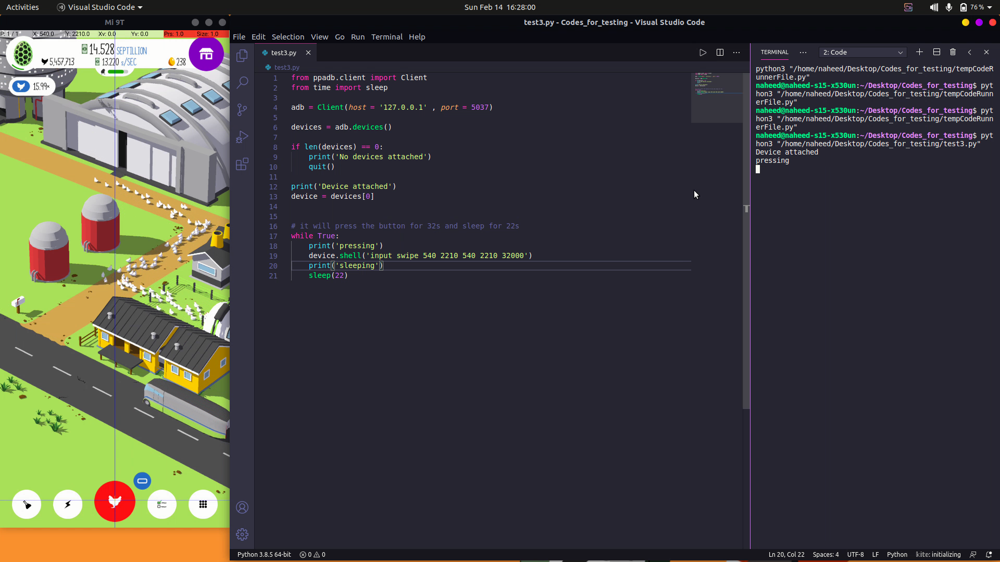

# automation-adb-egginc
Automating an android game named EGG INC


# Desclaimer :This is for educational purpose only

I have used ppadb library for controlling my android device.

## How to use:
- just find the x,y cordinates of the red button and run the script.
- adjust the timing accourding to your need.




<br>

## Code

```python
from ppadb.client import Client 
from time import sleep

adb = Client(host = '127.0.0.1' , port = 5037)

devices = adb.devices()

if len(devices) == 0:
    print('No devices attached')
    quit()

print('Device attached')
device = devices[0]


# it will press the button for 32s and sleep for 22s
while True:
    print('pressing')
    device.shell('input swipe 540 2210 540 2210 32000')
    print('sleeping')
    sleep(22)
    
```

The End

